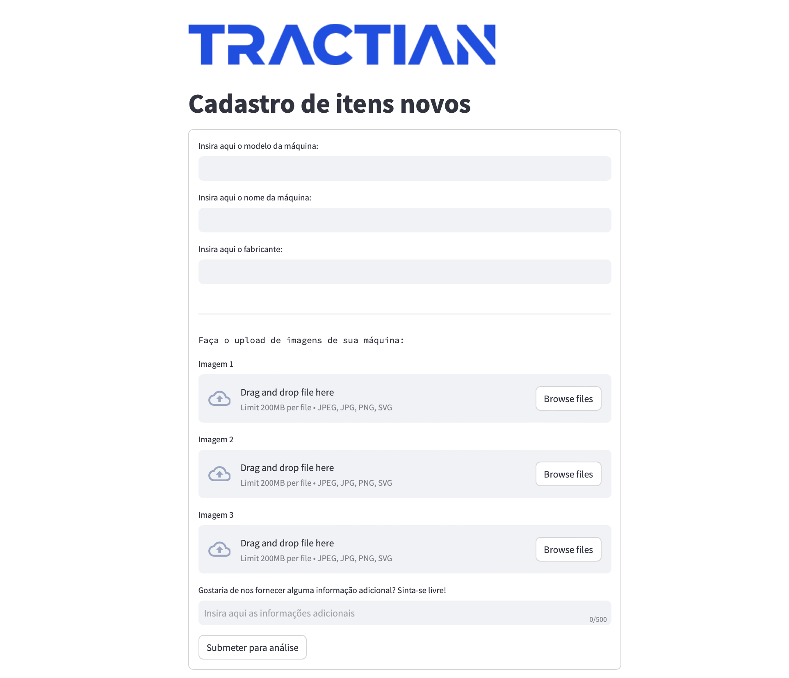
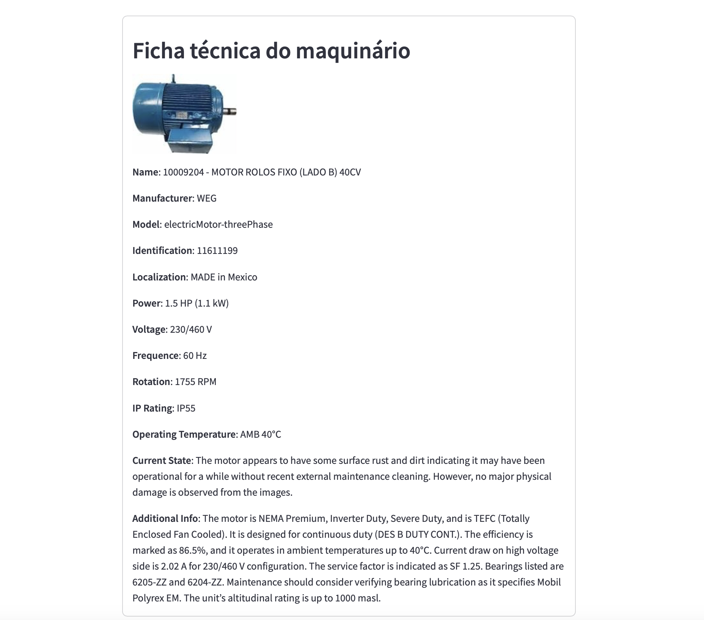

# Hackathon TRACTIAN 
We present a web application to fetch relevant information from machine images, such as power and operating temperature.



Usage
-----
To install run:
```install
./pip install -r requirements.txt
```
That's it! Now run this command to start the server:
```run
uvicorn main:app --reload
```
Finally, open up a new terminal to run the web app:
```run
streamlit run app.py
```

Using ChatGPT4 to identify the images
-----
We are using gpt-4o to analyze the image and parse the results into a pydantic JSON object. This is done using the **structured outputs** feature of the OpenAI API, which automatically parses and forces the results to the corresponding JSON file. We use 2 types of prompts, one for the system and other for the user. The first one is simpler, we tell the agent to pretend he's an experienced mechanical engineer hired by TRACTIAN - an innovative company specializing in sensors and predictive maintenance for machinery-, then we ask him to write a technical report about a particular machine. The latter prompt is more complex, we emphasize the fact that the Agent will receive three images but the most important one is the one with the machine plate, which contains the derating details of the particular machine. Furthermore, we describe step-by-step what the Agent should do to analyse this plate and look at the relevant details. We also emphasize a lot that whenever he's unsure about something, he should **NOT** make up factual information, and to express his concerns saying that he's not sure about some particular information. He should only use the images and data provided to draft the technical report.

FastAPI and Streamlit
-----
We used FastAPI to create the API that calls GPT and Streamlit to build the UI App. Streamlit is a very useful python package that helps us to create UI very fast, which is very important in a hackathon. On the other hand, streamlit is not very flexible with styles, which is a con.
FastAPI is very useful too. The API receives a HTTP request containing the informations submitted by the user and we use the informations to create the prompt. As a result from the API, the UI App receives a JSON containing informations that GPT infered, such as the machinery voltage.


Results
-----
Based on the results obtained, we designed the website with a clean white theme, incorporating the TRACTIAN logo to ensure a clear and user-friendly interface. After the user inputs the required data, such as three images, model, manufacturer, and machine name, a detailed technical datasheet is generated using the information extracted from the images and the provided data.

We observed that in cases where the images were of low quality, there were some minor inaccuracies. However, these inaccuracies remained within an acceptable margin, considering that certain details can be difficult to identify even with the naked eye. When the AI was unable to accurately identify a value, it classified the data as "unknown" to avoid providing incorrect information to the user.

In conclusion, the final result was satisfactory, fully meeting the proposed objectives.

Example of the app running:


Nice TODO:
-----
* Test multiple models and evaluate the cost benefit for each one.
* Create a Multi-LLM-Agent pipeline that gives us the most important infos for maintenance for each submission. This pipeline allows us to personalize the returned infos and filters other informations that we do not care about for that type of machinery.
* Migrate from Python Streamlit to another framework. Streamlit is not very scalable, which is a big problem. Other frameworks such: React, Vue, Django, etc., would be better.
* Sync the GPT result with update informations from the internet using web scrapping. We used web scrapping to fetch the image given the name, but we do not digged very deep into this solution because of time issues.

Refs:
-----
* https://platform.openai.com/docs/guides/vision
* https://platform.openai.com/docs/guides/vision
* https://fastapi.tiangolo.com/reference/
* https://docs.streamlit.io